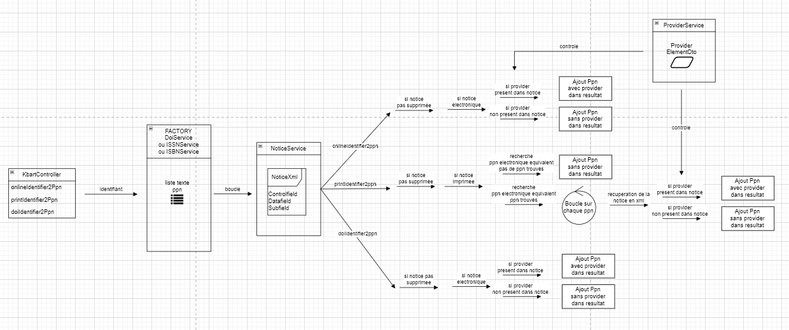
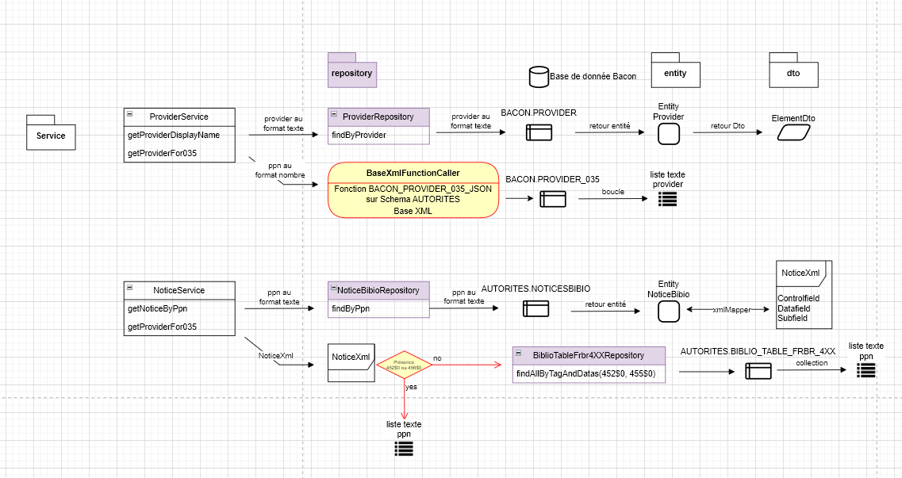
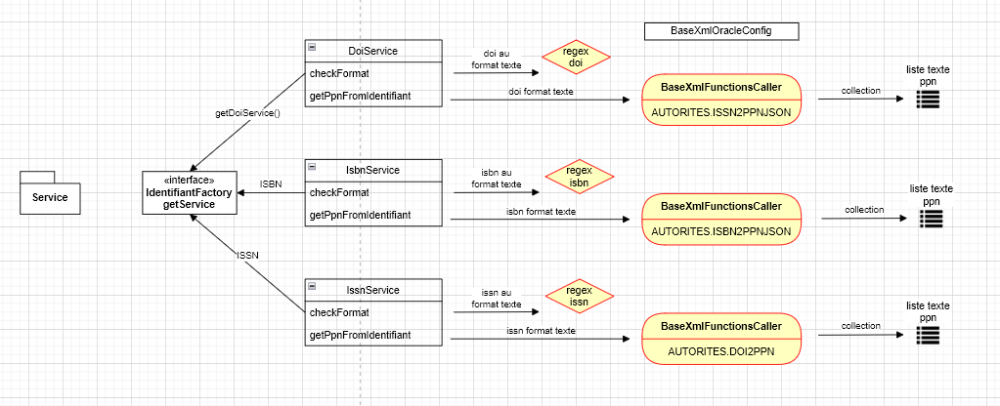

# sudoc-api

API permettant à partir d'identifiants présents sur une ligne kbart d'un fichier kbart de retourner une liste de ppn en résultats,
ou pour chaque ppn on aura :
- son type de document (IMPRIME,ELECTRONIQUE,AUTRE)
- son type de support (MONOGRAPHIE,PERIODIQUE,COLLECTION,RECUEIL,EXTRAIT,SERIE,AUTRE)
- si un provider est présent ou non pour ce ppn

**Cette API est exploitée par le projet bestppn-api dans son service BestPpnService (WsService)**

identifiants onlineIdentifier et printidentifier

identifiants doi

## Architecture globale de l'API kbart-webservices

L'architecture du controleur de l'application peut être représentée par le schéma suivant :

- A partir d'un identifiant onlineIdentifier, printIdentifier, doiIdentifier va être fourni une liste par le biais de service une liste de ppn.
- Pour chacun de ces ppn on obtiendra la notice correspondante au format NoticeXml.
- Puis sur chaque NoticeXml
- On controlera pour les 3 services que la notice n'a pas été supprimée
- On controlera le type de la notice
- On controlera si un provider est présent dans la notice
- Cas particulier pour les ppn imprimés : on recherchera des ppn electroniques équivalents

On fera pour cela appel à une couche service qui elle même fera des appels en base comme ci dessous, par le biais de fonctions oracle ou de requêtes directement sur les tables

Et pour la factory, qui elle même fait appel à des fonctions sur la base xml

## Documentation des webservices (url et paramètres)

## Deploiement

